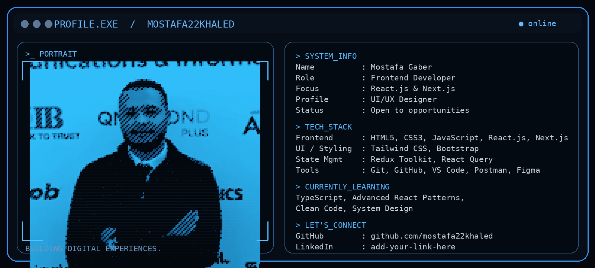

<h1 align="left">Hi 👋! My name is Mostafa</h1>

<h2 align="left">Frontend Developer (React.js & Next.js) | UI/UX Designer</h2>

---

## 👋 About Me

I'm a **Frontend Developer** and **Computer Science student** who enjoys building modern, responsive and user-friendly web applications.

- ⚛️ Focused on **React.js & Next.js**
- 🎨 Interested in **UI/UX and clean interfaces**
- 🌱 Currently learning **TypeScript & advanced React patterns**
- 🧠 Interested in **clean code and system design**
- 💼 Open to **Frontend internships and opportunities**

---

## 📊 GitHub Stats

---

## 🛠️ Languages & Tools

---

## 🚀 Featured Project

### 🛒 Nudra — Rare Collectibles Marketplace

A marketplace landing page built with a focus on responsive UI and clean frontend structure.

**Tech:** HTML · CSS · JavaScript · Bootstrap

---

## 📚 Currently Learning

`TypeScript` · `Next.js` · `Advanced React Patterns` · `Clean Code` · `System Design`

---

## 📫 Connect With Me

<!-- Replace the link below with your real LinkedIn profile -->

---

### `Code. Design. Build. Repeat. 🚀`

⭐ Thanks for visiting my profile!

